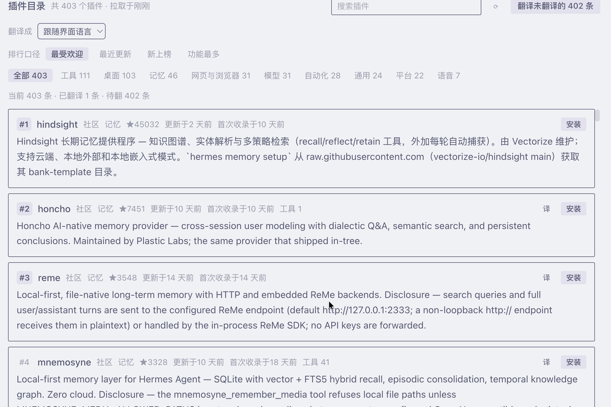

# CN-plugins-market

Browse the [Hermes](https://hermes-agent.nousresearch.com) plugin catalog **inside the Desktop app, in your own language.**

The curated catalog is written in English. This plugin adds a catalog page to Hermes Desktop that ranks it, installs from it, and — the point of the whole thing — **translates each plugin's blurb into the language you choose**, caching the translation so you only ever pay for it once.

> 官方插件目录是英文的。这个插件在 Hermes 桌面端里加一页「插件目录」：四档排行、一键安装，并把每个插件的简介**翻成你选的语言**（主要服务中文用户）——译文按插件缓存，翻过一次就永久复用。

## Features

- **A real ranking.** Sort the catalog by **most starred**, **recently updated**, **newly listed**, or **most capable** (tools + hooks), with the rank number on every card. Ranking, category and target language are compact dropdowns on one line, plus a search box that also matches the translation once you have one.
- **One-click install.** Same backend path as the built-in catalog page (`plugins.manage`), so installed state stays in sync across the app.
- **Enable or disable in place.** Installed entries carry the same on/off switch the built-in Plugins tab drives (`plugins.manage toggle`), so a fresh install is usable without hunting for the official page. Plugins that ship a separate desktop half get a one-click shortcut to that tab instead of a switch — the app owns desktop-plugin decisions and keeps them read-only for plugins, so the shortcut is the honest way to offer it.
- **Know what's installed.** `Installed only` narrows the list to what you actually have — including plugins installed outside the catalog (Git installs, bundled ones) that the catalog alone can't show — and a `Source` control splits your own installs from the built-in defaults, which stay hidden until you ask for them. `Uninstall` (behind a confirm dialog) removes the **whole package** — the agent half and the desktop half, so nothing is left running behind the scenes.
- **Follows the app language**, sidebar entry included: the nav label re-registers itself when you switch languages instead of stranding in the old one.
- **Translate on demand, or in bulk.** `Translate` on a single card, or `Translate N untranslated` to walk the current filter, with progress and a stop button. Bulk runs send **8 entries per model call**, so a 400-entry catalog is minutes, not hours.
- **Pick exactly what you want.** `Select` puts the list into selection mode: every card grows a checkbox, `Select all N shown` respects the current filter, and `Translate N selected` translates only those. The ticks clear themselves when the run finishes.
- **Live progress.** The bulk button carries a spinner, `done/total`, and the name of the plugin being translated right now, so a long run never looks frozen.
- **Cached per language, forever.** Translations are keyed by `<plugin>@<pinned sha>#<language>`, so switching the target language never shows you the previous language's text, and a plugin that updates comes back untranslated rather than showing a stale blurb. Everything else stays free.
- **Target language is yours.** Follows the app language by default (zh → 简体中文, zh-hant → 繁體中文, ja → 日本語, …), or pick from the list.
- **Click the name** to open the plugin's repository in your browser.

## 功能

- **真的排行**：按**最受欢迎 / 最近更新 / 新上榜 / 功能最多**（工具＋钩子）排序，每张卡带名次；排行口径、分类、目标语言都是一个紧凑下拉，跟搜索框一起占一行。
- **一键安装**：走和官方目录页同一个后端接口（`plugins.manage`），安装状态全 App 同步。
- **装完能直接用**：已安装的条目带一个**启用/停用开关**（就是官方插件页那个开关，走 `plugins.manage toggle`），不用再跑去官方页找。带**桌面半边**的插件不给开关、给一个**「去开桌面半边」按钮**——桌面插件的开关归 App 自己管（SDK 对插件只读），所以这里只负责一键把你送到「技能与工具 → 插件」。
- **看得见装了什么**：点「只看已安装」把列表收成你已经装的那些——**连目录里没有的也列出来**（从 Git 装的、随包内置的），目录本身看不到它们；旁边的「来源」再把**自己装的**和**官方自带的**分开，内置的默认不出现在列表里。每个已安装的条目带「卸载」（点了先弹确认），**一次删干净整个包**——agent 半边和桌面半边一起删，不会留下还在跑的残留。
- **界面语言跟着 App 走**，侧栏那行也是：切语言时它会重新注册，不会卡在旧语言。
- **单条翻，也能批量翻**：单卡一个「译」；顶上「翻译未翻译的 N 条」按当前筛选往下推，带进度和停止按钮。批量是**一次调用翻译 8 条**，400 条是几分钟的量级。
- **想翻哪几条自己勾**：点「多选」进入选择模式，每张卡左边才出现勾选框；「全选当前 N 条」会跟随当前筛选；「翻译选中的 N 条」只翻这几条。**翻译跑完勾选会自动清空**，不用手动收拾。
- **进度是活的**：批量翻译时按钮上带转轮和 `已完成/总数`，右侧还会显示**正在翻哪一个插件**，跑久了也不会像卡死。
- **译文按语言分别缓存**：key 是 `<插件>@<pin 的 commit>#<语言>`，所以**切换目标语言不会拿旧语言的译文糊弄你**；插件更新了旧译文也会自动作废。其余永远免二次开销。
- **目标语言自选**：默认跟随界面语言（zh → 简体中文，zh-hant → 繁體中文，ja → 日本語……），也可手动指定。
- **点插件名**直接在浏览器里打开它的源码仓库。

## Install

From the Hermes plugin catalog:

```bash
hermes plugins install cn-plugins-market --enable
```

or manually:

```bash
git clone https://github.com/krintcal/CN-plugins-market.git ~/.hermes/desktop-plugins/cn-plugins-market
```

Then, in the Desktop app: **⌘K → Reload desktop plugins**. The page appears in the sidebar as **Plugin catalog** (中文界面下显示为「插件目录」).

## 安装

```bash
hermes plugins install cn-plugins-market --enable
```

装完在桌面端按 **⌘K → Reload desktop plugins**，左侧导航就会出现「插件目录」。

## Screenshots / 截图



The `screenshots/` folder also fills the gallery on the plugin's catalog page.
`screenshots/` 目录同时会作为插件在官方目录页的图集。

## How it works

- Desktop-only plugin: a single ESM file, `desktop/plugin.js`, using nothing but the public plugin SDK (`@hermes/plugin-sdk`) — it registers one full page (`ROUTES_AREA`) and one sidebar row (`SIDEBAR_NAV_AREA`).
- The catalog is fetched from the same public URL the app itself uses (`plugins.json`), with HTTP caching disabled so re-opening the page always shows the current listing.
- Ranking, search, filters, the translation cache and your last-used sort/language are computed and stored locally (`ctx.storage`).

## Cost & privacy

- Browsing, ranking, searching and installing are **free** and read no credentials.
- The only model call is an explicit translation, one plugin per call, through the gateway's `llm.oneshot` on **whatever provider and model you already have active** — no separate key, no separate bill. Bulk-translating a 400-entry catalog is a fraction of a cent on a cheap model; after that it is cached and free.
- Nothing leaves your machine except the catalog fetch (the same public URL the app fetches) and your own translation calls to your own provider. No telemetry, no self-updater. Opening a repository happens only when you click a plugin name.

## 成本与隐私

- 浏览、排行、搜索、安装**全部免费**，不碰任何凭证。
- 唯一会调模型的动作是「翻译」，一次一条，走网关的 `llm.oneshot`，用的是**你当前已经在用的 provider 和模型**——不用另配密钥，也不会多出一份账单。400 条全翻一遍，在便宜模型上是几毛钱量级；翻完进缓存，之后永久免费。
- 除了抓取那份公开目录（App 自己也在抓的同一个 URL）和你自己发出的翻译请求，什么都不会离开这台机器。没有遥测，没有自更新；打开仓库只在你点插件名时发生。

## Requirements

- Hermes Agent Desktop, `>=0.21.5`.

## License

MIT — see [LICENSE](LICENSE).
